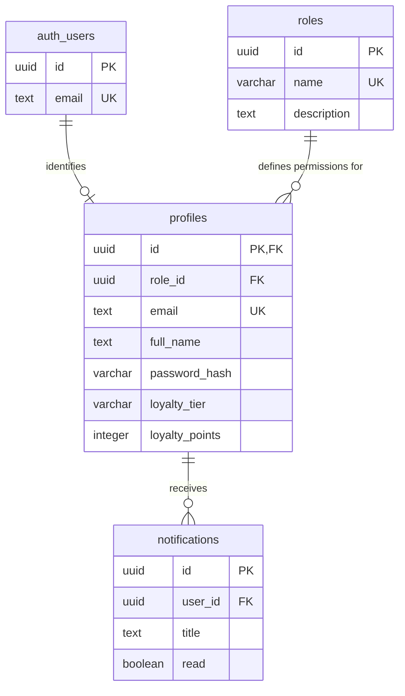
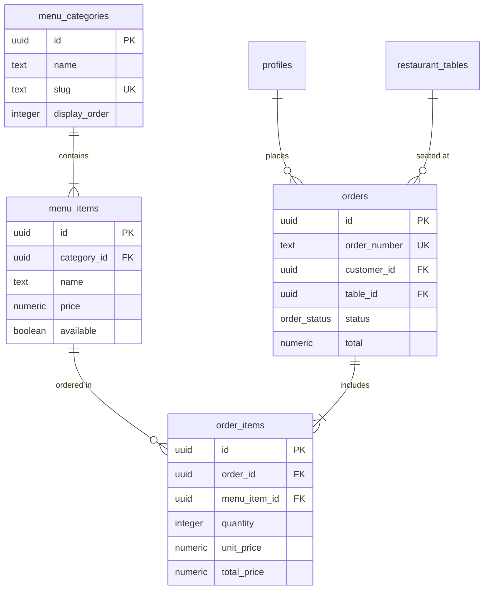
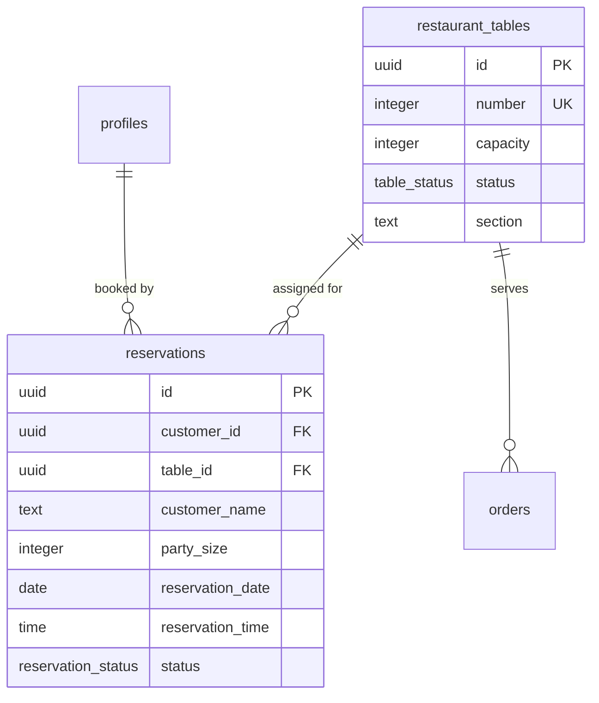
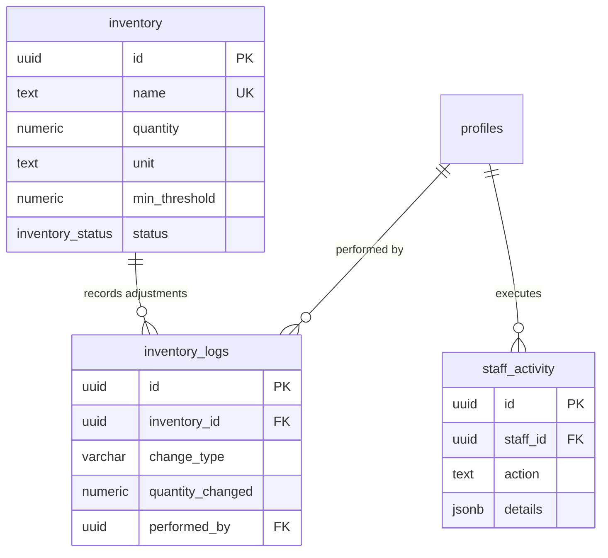
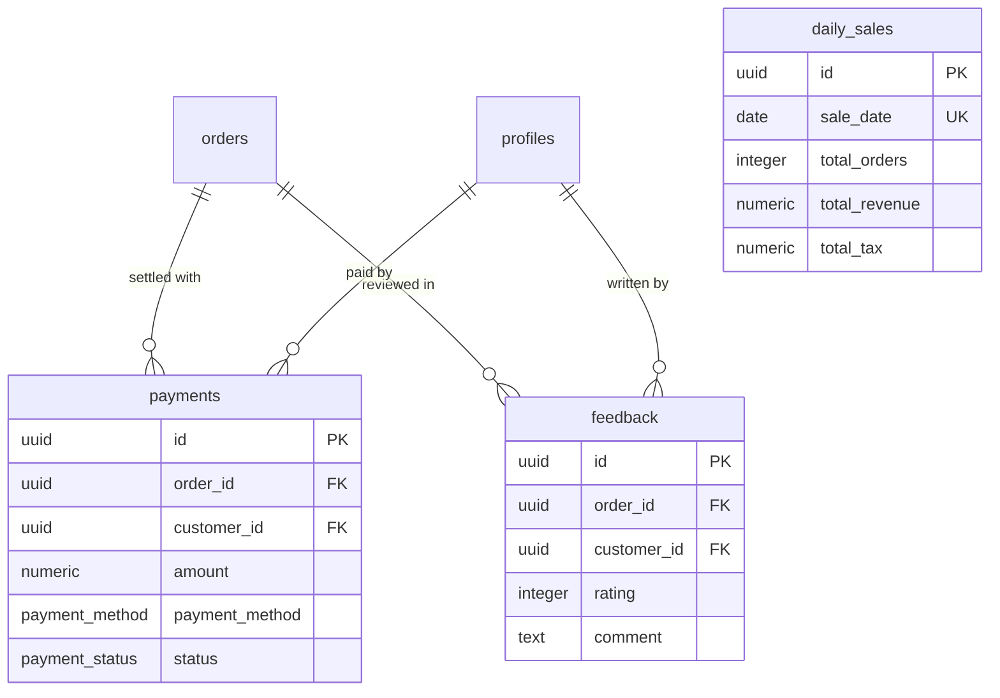

# 🗄️ RestaurantOS Database Schema & ER Diagrams

This document provides a visual and technical specification of the PostgreSQL database schema for **RestaurantOS**.

---

## 📐 Complete Entity-Relationship (ER) Diagram

```mermaid
erDiagram
    auth_users ||--o| profiles : "authenticates"
    roles ||--o{ profiles : "assigned to"
    
    profiles ||--o{ reservations : "books"
    restaurant_tables ||--o{ reservations : "reserved for"
    
    profiles ||--o{ orders : "places"
    restaurant_tables ||--o{ orders : "assigned to"
    
    orders ||--|{ order_items : "contains"
    menu_categories ||--|{ menu_items : "categorizes"
    menu_items ||--o{ order_items : "ordered as"
    
    orders ||--o{ payments : "paid via"
    profiles ||--o{ payments : "processed for"
    
    inventory ||--o{ inventory_logs : "tracked in"
    profiles ||--o{ inventory_logs : "performed by"
    
    profiles ||--o{ notifications : "receives"
    orders ||--o{ feedback : "evaluated in"
    profiles ||--o{ feedback : "submitted by"
    profiles ||--o{ staff_activity : "logged for"

    auth_users {
        uuid id PK
        text email UK
    }

    roles {
        uuid id PK
        varchar name UK
        text description
        timestamptz created_at
        timestamptz updated_at
    }

    profiles {
        uuid id PK, FK
        uuid role_id FK
        text email UK
        text full_name
        text avatar_url
        text phone
        varchar password_hash
        varchar loyalty_tier
        integer loyalty_points
        varchar security_question
        varchar security_answer_hash
        timestamptz created_at
        timestamptz updated_at
    }

    menu_categories {
        uuid id PK
        text name
        text slug UK
        text description
        integer display_order
        timestamptz created_at
        timestamptz updated_at
    }

    menu_items {
        uuid id PK
        uuid category_id FK
        text name
        text description
        numeric price
        text image_url
        integer preparation_time
        boolean available
        boolean popular
        text_array tags
        timestamptz created_at
        timestamptz updated_at
    }

    restaurant_tables {
        uuid id PK
        integer number UK
        integer capacity
        table_status status
        text section
        timestamptz created_at
        timestamptz updated_at
    }

    reservations {
        uuid id PK
        uuid customer_id FK
        uuid table_id FK
        text customer_name
        integer party_size
        date reservation_date
        time reservation_time
        reservation_status status
        text special_requests
        timestamptz created_at
        timestamptz updated_at
    }

    orders {
        uuid id PK
        text order_number UK
        uuid customer_id FK
        uuid table_id FK
        text customer_name
        order_type order_type
        order_status status
        numeric subtotal
        numeric tax
        numeric service_fee
        numeric total
        text special_instructions
        timestamptz created_at
        timestamptz updated_at
    }

    order_items {
        uuid id PK
        uuid order_id FK
        uuid menu_item_id FK
        text name
        integer quantity
        numeric unit_price
        numeric total_price
        text notes
        timestamptz created_at
    }

    inventory {
        uuid id PK
        text name UK
        text category
        numeric quantity
        text unit
        numeric min_threshold
        inventory_status status
        timestamptz last_restocked
        timestamptz created_at
        timestamptz updated_at
    }

    inventory_logs {
        uuid id PK
        uuid inventory_id FK
        varchar change_type
        numeric quantity_changed
        numeric previous_quantity
        numeric new_quantity
        text notes
        uuid performed_by FK
        timestamptz created_at
    }

    payments {
        uuid id PK
        uuid order_id FK
        uuid customer_id FK
        numeric amount
        payment_method payment_method
        payment_status status
        text transaction_reference
        timestamptz created_at
        timestamptz updated_at
    }

    notifications {
        uuid id PK
        uuid user_id FK
        text title
        text message
        boolean read
        notification_type type
        timestamptz created_at
    }

    feedback {
        uuid id PK
        uuid order_id FK
        uuid customer_id FK
        integer rating
        text comment
        timestamptz created_at
    }

    staff_activity {
        uuid id PK
        uuid staff_id FK
        text action
        jsonb details
        timestamptz created_at
    }

    daily_sales {
        uuid id PK
        date sale_date UK
        integer total_orders
        numeric total_revenue
        numeric total_tax
        numeric total_discounts
        integer dine_in_count
        integer takeout_count
        timestamptz created_at
        timestamptz updated_at
    }
```

---

## 🧩 Sub-System Component Diagrams

### 1. User Authentication & Authorization Module

Manages identity, roles (`admin`, `staff`, `customer`), password security, and customer loyalty rewards.

---

### 2. Menu Catalog & Ordering Module

Handles menu taxonomy, dish items, customer orders, and individual line items.

---

### 3. Reservations & Table Management Module

Manages table capacity, sections, availability, and customer table bookings.

---

### 4. Inventory Control & Audit Module

Tracks ingredient stock quantities, reorder thresholds, and staff audit logs.

---

### 5. Payments, Feedback & Financial Analytics Module

Handles order payment transactions, customer reviews, and aggregated daily financial reporting.

---

## 📑 Data Dictionary & Key Constraints

| Table Name | Column Name | Data Type | Constraints | Description |
| :--- | :--- | :--- | :--- | :--- |
| `roles` | `id` | `UUID` | `PRIMARY KEY` | Unique role identifier |
| | `name` | `VARCHAR(50)` | `UNIQUE, NOT NULL` | Role name (`admin`, `staff`, `customer`, `host`) |
| `profiles` | `id` | `UUID` | `PRIMARY KEY, REFERENCES auth.users(id)` | Extends user auth identity |
| | `role_id` | `UUID` | `FOREIGN KEY (roles.id)` | Role reference |
| | `email` | `TEXT` | `UNIQUE, NOT NULL` | User email address |
| | `password_hash` | `VARCHAR(255)` | | Bcrypt password hash |
| `menu_categories` | `id` | `UUID` | `PRIMARY KEY` | Category identifier |
| | `slug` | `TEXT` | `UNIQUE, NOT NULL` | URL slug |
| `menu_items` | `id` | `UUID` | `PRIMARY KEY` | Menu item identifier |
| | `category_id` | `UUID` | `FOREIGN KEY (menu_categories.id)` | Parent category |
| | `price` | `NUMERIC(10,2)`| `CHECK (price >= 0)` | Price in local currency |
| | `tags` | `TEXT[]` | `NOT NULL DEFAULT '{}'` | Array of tag strings |
| `restaurant_tables`| `id` | `UUID` | `PRIMARY KEY` | Table identifier |
| | `number` | `INTEGER` | `UNIQUE, CHECK (number > 0)` | Physical table number |
| `reservations` | `id` | `UUID` | `PRIMARY KEY` | Booking identifier |
| | `customer_id` | `UUID` | `FOREIGN KEY (profiles.id)` | Customer reference |
| | `table_id` | `UUID` | `FOREIGN KEY (restaurant_tables.id)`| Assigned table |
| `orders` | `id` | `UUID` | `PRIMARY KEY` | Order identifier |
| | `order_number` | `TEXT` | `UNIQUE, NOT NULL` | Human readable order reference |
| `order_items` | `order_id` | `UUID` | `FOREIGN KEY (orders.id) ON DELETE CASCADE` | Linked parent order |
| `inventory` | `name` | `TEXT` | `UNIQUE, NOT NULL` | Stock item name |
| `daily_sales` | `sale_date` | `DATE` | `UNIQUE, NOT NULL` | Daily aggregation date |

---

## ⚡ Key Indexes for Performance

The database schema includes target indexes for fast queries and joins:
- `idx_profiles_role_id`, `idx_profiles_email`
- `idx_menu_items_category_id`, `idx_menu_items_available`, `idx_menu_items_popular`
- `idx_reservations_customer_id`, `idx_reservations_date`, `idx_reservations_status`
- `idx_orders_customer_id`, `idx_orders_status`, `idx_orders_order_number`, `idx_orders_created_at`
- `idx_order_items_order_id`, `idx_order_items_menu_item_id`
- `idx_payments_order_id`, `idx_notifications_user_id`
